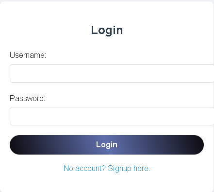
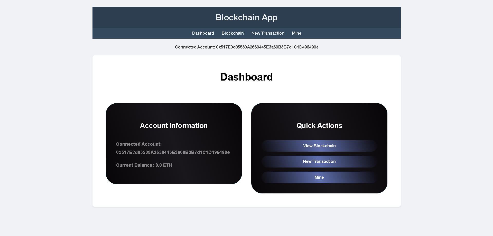
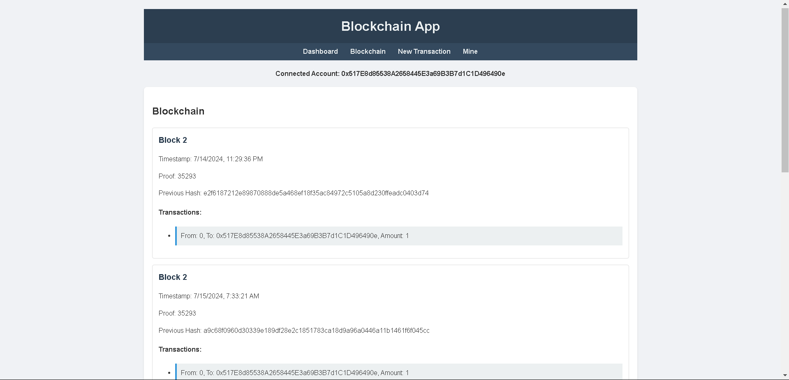
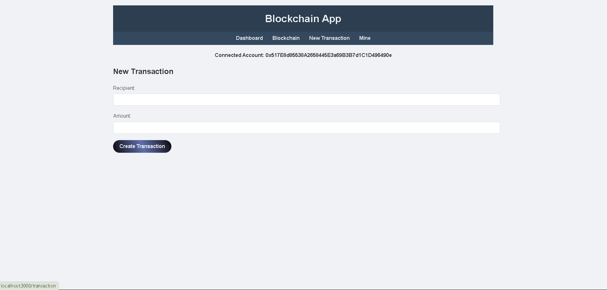
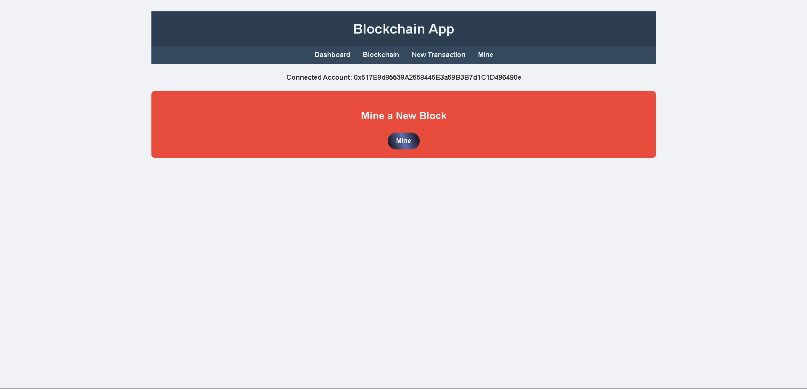

<h1 align="center">Secure block chain system using blockchain</h1>

<h3 align="left">Created a secure block chain system using flask as a backend react as a frontend in integration with mongodb and used blockchain metamask wallet and ganche for fake token.</h3>

<h3 align="left">image for Login/Signup form </h3>

<h3 align="left">image for Dashboard page </h3>

<h3 align="left">image for blockchain hostory page </h3>

<h3 align="left">image for new transcation page </h3>

<h3 align="left">image for mine page </h3>

